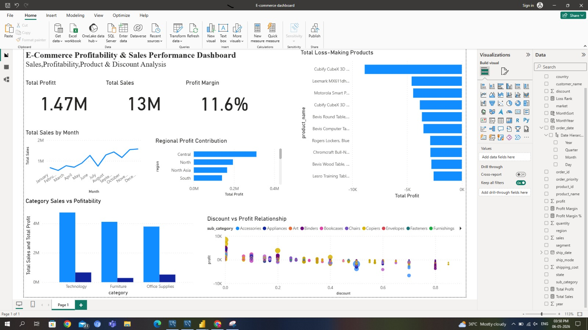

# 📊 E-Commerce Profitability & Sales Performance Analysis

## 📌 Project Overview

In this project, I analyzed an e-commerce dataset with over $13M in sales to understand how revenue translates into profitability.

Although the business generates strong sales, the overall profit margin (~11.6%) is relatively modest. This analysis focuses on identifying key drivers of revenue, understanding profit leakage, and evaluating the impact of discounts, product performance, and regional differences.

---

## 🎯 Objective

The goal of this project is to:

* Identify key drivers of sales and profit
* Analyze category and regional performance
* Understand the impact of discounting on profitability
* Highlight loss-making products
* Provide actionable business recommendations

---

## 🛠 Tools & Technologies

* Power BI
* Data Modeling
* DAX (Measures & KPIs)
* Data Visualization
* Business Analysis

---

## 📊 Dashboard Preview

---

## 🔍 Key Insights

### Revenue vs Profitability

* The business generated over $13M in sales
* Profit margin is ~11.6%, indicating moderate profitability

### Sales Trends

* Sales show a steady upward trend
* Stronger performance toward the end of the year suggests seasonality

### Category Performance

* Technology is the highest-performing category
* Furniture and Office Supplies show lower profitability

### Regional Analysis

* The Central region contributes the most profit
* Profitability varies significantly across regions

### Loss-Making Products

* Several products consistently generate negative profit
* Indicates pricing or cost inefficiencies

### Discount Impact

* Higher discounts are often associated with lower or negative profit
* Suggests margin erosion due to aggressive discounting

---

## 💡 Recommendations

* Optimize discount strategies to reduce margin loss
* Focus on high-performing categories for growth
* Investigate underperforming regions
* Reassess or discontinue loss-making products

---

## 📈 Dashboard Features

* KPI cards (Total Sales, Total Profit, Profit Margin)
* Monthly sales trend analysis
* Category-level performance comparison
* Regional profit contribution visualization
* Product-level loss analysis
* Discount vs Profit relationship analysis

---

## 📂 Project Files

* `dashboard.pbix` → Power BI dashboard
* `SuperStoreOrders.csv` → Dataset used
* `images/dashboard.jpg` → Dashboard preview

---

## 🚀 Conclusion

This project demonstrates how data analysis can uncover actionable insights beyond basic reporting. By analyzing sales, profitability, and pricing behavior, it highlights key opportunities to improve business performance and support data-driven decision-making.
